README
================
Yuxi Lin
2/27/2020

STEP 1: IMPORTING AND TIDYING DATA

For homework 2, I took a look at the bridges and BLS unemployment data
from Dec and Nov, 2018 in CA. There are in total 25737 bridges. I first
grouped them by their fips code (CA has a uniform state code as 6, and
its counties have different county codes. BLS dataset has already
included fipscode. Thus, to get the fips code in bridges data, I
multiplied the state code by 1000 and add the county code to it.) Then,
I summarize the counts of bridges, means of average daily traffic, means
of bridge roadway width, means of roadway improvement cost, means of
total project cost, and means of average daily truck traffic by each
fips code, so I got the characteristic data for each county in CA. I
choose the above features because I assume that they will be somehow
predictive to a county’s unemployment using logical reasonings. I also
test my assumption by picking the parameters with small p values as
significant ones from fitting linear model individually. After that,
since fips code is the key for the summary of bridges and BLS data, we
can left join the summary with BLS unemployment data. Now, we have the
final dataset to fit the linear model.

``` r
library("blscrapeR")
library("dplyr")
```

    ## 
    ## Attaching package: 'dplyr'

    ## The following objects are masked from 'package:stats':
    ## 
    ##     filter, lag

    ## The following objects are masked from 'package:base':
    ## 
    ##     intersect, setdiff, setequal, union

``` r
# CA bls data for Dec-2018:
df1 = get_bls_county(date_mth = "December 2018", stateName = "California")
# CA bls data for Nov-2018:
df2 = get_bls_county(date_mth = "November 2018", stateName = "California")
# bridges data for CA in 2018
data = read.csv("https://www.fhwa.dot.gov/bridge/nbi/2018/delimited/CA18.txt")

data$COUNTY_CODE_003 = as.integer(data$COUNTY_CODE_003)
data$STATE_CODE_001 = as.integer(data$STATE_CODE_001)
data$ROADWAY_WIDTH_MT_051 = as.numeric(data$ROADWAY_WIDTH_MT_051)
data$IMP_LEN_MT_076 = as.numeric(data$IMP_LEN_MT_076)
data$PERCENT_ADT_TRUCK_109 = as.integer(data$PERCENT_ADT_TRUCK_109)

new_data = data %>% 
  select(STATE_CODE_001, COUNTY_CODE_003, ADT_029, 
         ROADWAY_WIDTH_MT_051, ROADWAY_IMP_COST_095, 
         TOTAL_IMP_COST_096, PERCENT_ADT_TRUCK_109) %>% 
  mutate(fips_code = COUNTY_CODE_003+STATE_CODE_001*1000) %>% 
  group_by(fips_code) %>% 
  arrange(fips_code) %>% 
  summarize(count = n(), ADT = mean(ADT_029, na.rm = TRUE), ROADWAY_WIDTH_MT = mean(ROADWAY_WIDTH_MT_051, na.rm = TRUE),
            ROADWAY_IMP_COST = mean(ROADWAY_IMP_COST_095, na.rm = TRUE), TOTAL_IMP_COST = mean(TOTAL_IMP_COST_096, na.rm = TRUE), 
            PERCENT_ADT_TRCUCK = mean(PERCENT_ADT_TRUCK_109, na.rm = TRUE)) 

df1$fips = as.integer(df1$fips)

final_data = df1 %>% left_join(new_data, by = c("fips" = "fips_code"))
```

STEP 2: FITTING THE LINEAR MODEL

Now, we fit a linear model to predict the number of unemployed using the
features from the bridges data.

``` r
lm1 = lm(final_data$unemployed~final_data$count+final_data$ADT+
           final_data$ROADWAY_WIDTH_MT+final_data$ROADWAY_IMP_COST+
           final_data$TOTAL_IMP_COST+final_data$PERCENT_ADT_TRCUCK)
summary(lm1)
```

    ## 
    ## Call:
    ## lm(formula = final_data$unemployed ~ final_data$count + final_data$ADT + 
    ##     final_data$ROADWAY_WIDTH_MT + final_data$ROADWAY_IMP_COST + 
    ##     final_data$TOTAL_IMP_COST + final_data$PERCENT_ADT_TRCUCK)
    ## 
    ## Residuals:
    ##    Min     1Q Median     3Q    Max 
    ## -26013  -4642   1311   6026  31841 
    ## 
    ## Coefficients:
    ##                                 Estimate Std. Error t value Pr(>|t|)    
    ## (Intercept)                   24813.4215 10467.9494   2.370  0.02159 *  
    ## final_data$count                 60.2061     4.1372  14.552  < 2e-16 ***
    ## final_data$ADT                    0.9534     0.4060   2.348  0.02278 *  
    ## final_data$ROADWAY_WIDTH_MT   -4351.4378  1308.4950  -3.326  0.00164 ** 
    ## final_data$ROADWAY_IMP_COST    -240.9000   244.4802  -0.985  0.32910    
    ## final_data$TOTAL_IMP_COST        28.8721    29.1136   0.992  0.32602    
    ## final_data$PERCENT_ADT_TRCUCK  -180.9268   449.3928  -0.403  0.68892    
    ## ---
    ## Signif. codes:  0 '***' 0.001 '**' 0.01 '*' 0.05 '.' 0.1 ' ' 1
    ## 
    ## Residual standard error: 10070 on 51 degrees of freedom
    ## Multiple R-squared:  0.9126, Adjusted R-squared:  0.9024 
    ## F-statistic: 88.79 on 6 and 51 DF,  p-value: < 2.2e-16

``` r
plot(lm1)
```

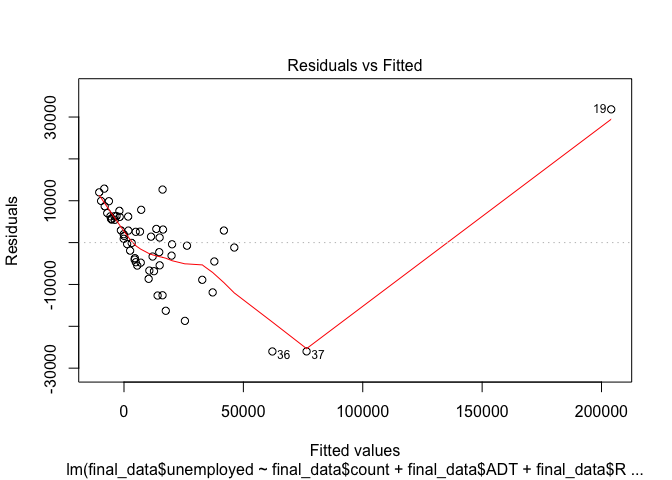<!-- -->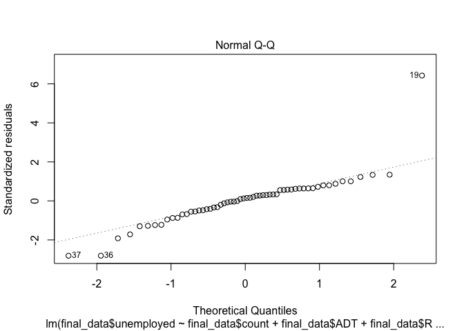<!-- -->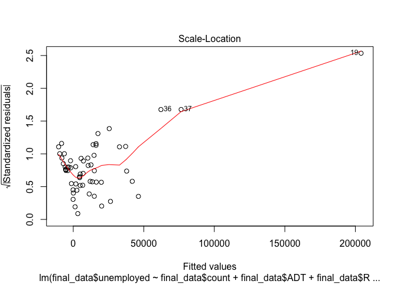<!-- -->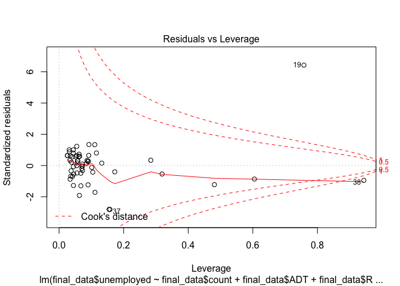<!-- -->

From the R output, we can see that the R^2 is 0.9126, which means that
the features from bridges data (aka the count of bridges, mean of
average daily traffic, mean of bridge roadway width, mean of roadway
improvement cost, mean of total project cost, and mean of average daily
truck traffic) have a good power to predict the number of unemployed for
each county in CA using a linear model. Looking at the p value for each
beta, we notice that among all the variables, the count of bridges, mean
of average daily traffic, and mean of bridge roadway width have p values
less than 0.05, which means that they are statistically significant in
this model. From the diagnosis plots, I notice that 19 is an outlier in
this data, as it sits far away from the majority of points, the qq plot
and also the Cook’s distance lines. This point refers to Los Angelels
County, which has 23440 unemployed. This number of unemployed is
relatively huge compared to other counties, causing it to be an outlier.

Now, we fit a linear model to predict the unemployment rate using the
features from the bridges data.

``` r
lm2 = lm(final_data$unemployed_rate~final_data$count+final_data$ADT+
           final_data$ROADWAY_WIDTH_MT+final_data$ROADWAY_IMP_COST+
           final_data$TOTAL_IMP_COST+final_data$PERCENT_ADT_TRCUCK)
summary(lm2)
```

    ## 
    ## Call:
    ## lm(formula = final_data$unemployed_rate ~ final_data$count + 
    ##     final_data$ADT + final_data$ROADWAY_WIDTH_MT + final_data$ROADWAY_IMP_COST + 
    ##     final_data$TOTAL_IMP_COST + final_data$PERCENT_ADT_TRCUCK)
    ## 
    ## Residuals:
    ##     Min      1Q  Median      3Q     Max 
    ## -3.9862 -1.3278 -0.2908  0.6674  7.9941 
    ## 
    ## Coefficients:
    ##                                 Estimate Std. Error t value Pr(>|t|)    
    ## (Intercept)                    4.770e+00  2.326e+00   2.051   0.0454 *  
    ## final_data$count               1.076e-03  9.192e-04   1.171   0.2472    
    ## final_data$ADT                 7.548e-06  9.021e-05   0.084   0.9336    
    ## final_data$ROADWAY_WIDTH_MT   -3.171e-01  2.907e-01  -1.091   0.2805    
    ## final_data$ROADWAY_IMP_COST   -2.467e-02  5.432e-02  -0.454   0.6516    
    ## final_data$TOTAL_IMP_COST      2.955e-03  6.469e-03   0.457   0.6498    
    ## final_data$PERCENT_ADT_TRCUCK  4.653e-01  9.985e-02   4.660  2.3e-05 ***
    ## ---
    ## Signif. codes:  0 '***' 0.001 '**' 0.01 '*' 0.05 '.' 0.1 ' ' 1
    ## 
    ## Residual standard error: 2.238 on 51 degrees of freedom
    ## Multiple R-squared:  0.4597, Adjusted R-squared:  0.3961 
    ## F-statistic: 7.232 on 6 and 51 DF,  p-value: 1.279e-05

``` r
plot(lm2)
```

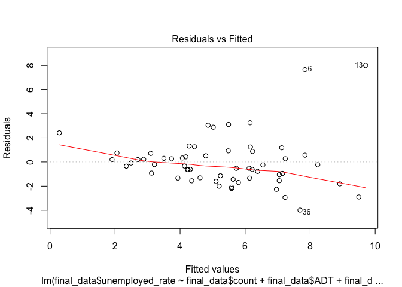<!-- -->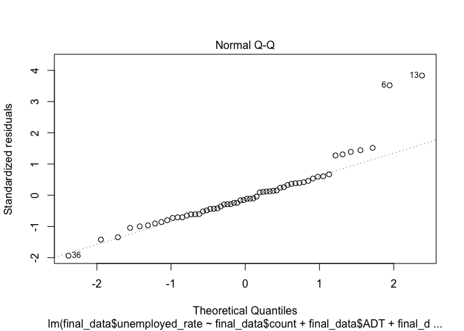<!-- -->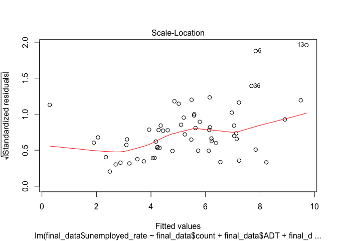<!-- -->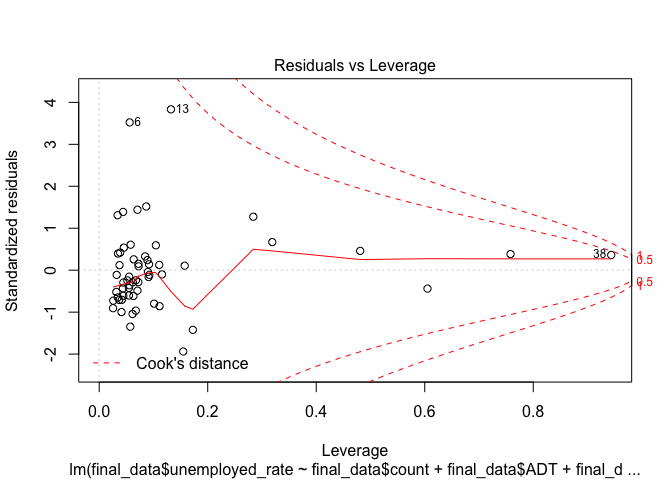<!-- -->

From the R output, we can see that the R^2 is 0.4597, which means that
the features from bridges data (aka the count of bridges, mean of
average daily traffic, mean of bridge roadway width, mean of roadway
improvement cost, mean of total project cost, and mean of average daily
truck traffic) have a decent power to predict the unemployment rate for
each county in CA using a linear model. Looking at the p value for each
beta, we notice that among all the variables, average daily truck
traffic has a p values of less than 0.05, which means that it is
statistically significant in this model. From the diagnosis plots, I
notice that 6 and 13 are outliers in this data, as they sit far away
from the majority of points, the qq plot and also in the leverage plot.
6 refers to Colusa County, with unemployment rate of 15.5, and 13 refers
to Imperial County, with unemployment rate of 17.7. Their unemployment
rates are relatively large compared to other counties, causing them to
be outliers.

STEP 3: COUNTING INTO THE PREVIOUS MONTH

Now, we fit a linear model to predict the number of employed (in
DEC-2018) using the features from the bridges data, and the unemployed
number and rate from the previous month as additional predictors.

``` r
#joining in the data for previous month(Nov-2018)
df2 = df2 %>% rename(unemployed_previous = unemployed, unemployed_rate_previous= unemployed_rate)
df2$fips = as.integer(df2$fips)
final_data = final_data %>% left_join(df2, by = "fips")

lm3 = lm(final_data$unemployed~final_data$count+final_data$ADT+
           final_data$ROADWAY_WIDTH_MT+final_data$ROADWAY_IMP_COST+
           final_data$TOTAL_IMP_COST+final_data$PERCENT_ADT_TRCUCK+
           final_data$unemployed_previous+final_data$unemployed_rate_previous)
summary(lm3)
```

    ## 
    ## Call:
    ## lm(formula = final_data$unemployed ~ final_data$count + final_data$ADT + 
    ##     final_data$ROADWAY_WIDTH_MT + final_data$ROADWAY_IMP_COST + 
    ##     final_data$TOTAL_IMP_COST + final_data$PERCENT_ADT_TRCUCK + 
    ##     final_data$unemployed_previous + final_data$unemployed_rate_previous)
    ## 
    ## Residuals:
    ##     Min      1Q  Median      3Q     Max 
    ## -1513.6  -399.0  -258.4   -31.5  5747.7 
    ## 
    ## Coefficients:
    ##                                       Estimate Std. Error t value Pr(>|t|)
    ## (Intercept)                         -1.124e+03  1.200e+03  -0.937    0.354
    ## final_data$count                     2.767e-01  1.012e+00   0.273    0.786
    ## final_data$ADT                      -7.096e-02  4.635e-02  -1.531    0.132
    ## final_data$ROADWAY_WIDTH_MT          1.982e+02  1.562e+02   1.269    0.210
    ## final_data$ROADWAY_IMP_COST         -1.266e+01  2.650e+01  -0.477    0.635
    ## final_data$TOTAL_IMP_COST            1.550e+00  3.156e+00   0.491    0.626
    ## final_data$PERCENT_ADT_TRCUCK        1.006e+01  5.740e+01   0.175    0.862
    ## final_data$unemployed_previous       1.008e+00  1.548e-02  65.103   <2e-16
    ## final_data$unemployed_rate_previous -6.183e+00  7.537e+01  -0.082    0.935
    ##                                        
    ## (Intercept)                            
    ## final_data$count                       
    ## final_data$ADT                         
    ## final_data$ROADWAY_WIDTH_MT            
    ## final_data$ROADWAY_IMP_COST            
    ## final_data$TOTAL_IMP_COST              
    ## final_data$PERCENT_ADT_TRCUCK          
    ## final_data$unemployed_previous      ***
    ## final_data$unemployed_rate_previous    
    ## ---
    ## Signif. codes:  0 '***' 0.001 '**' 0.01 '*' 0.05 '.' 0.1 ' ' 1
    ## 
    ## Residual standard error: 1080 on 49 degrees of freedom
    ## Multiple R-squared:  0.999,  Adjusted R-squared:  0.9989 
    ## F-statistic:  6344 on 8 and 49 DF,  p-value: < 2.2e-16

``` r
plot(lm3)
```

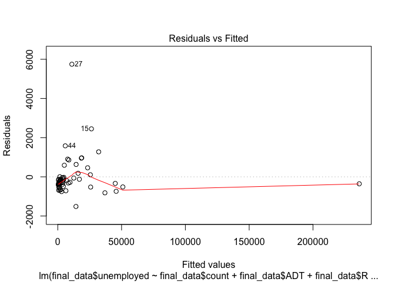<!-- -->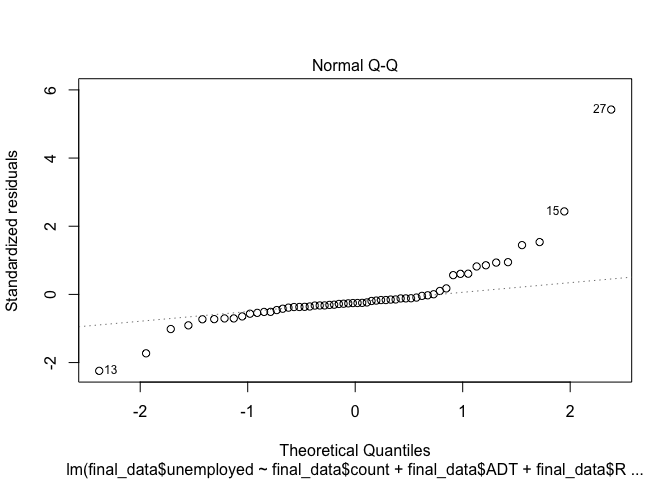<!-- -->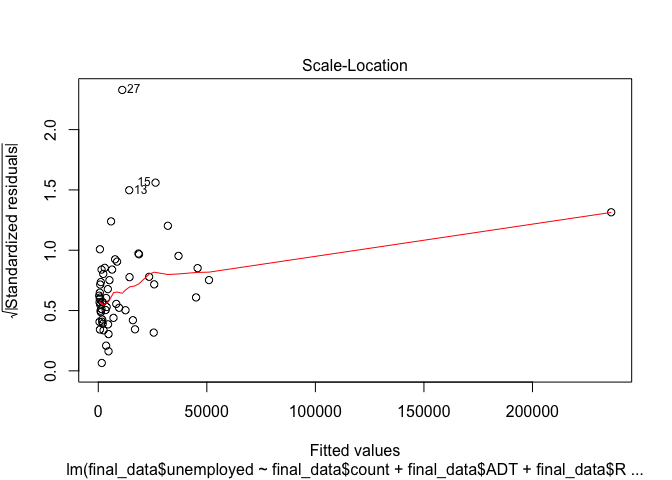<!-- -->

    ## Warning in sqrt(crit * p * (1 - hh)/hh): NaNs produced
    
    ## Warning in sqrt(crit * p * (1 - hh)/hh): NaNs produced

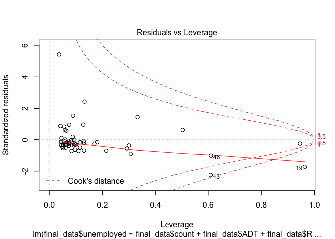<!-- -->

From the R output, we can see that the R^2 is 0.999, which means that
the features from bridges data (aka the count of bridges, mean of
average daily traffic, mean of bridge roadway width, mean of roadway
improvement cost, mean of total project cost, and mean of average daily
truck traffic) plus the unemployed number and rate from Nov have a
perfect power to predict the number of unemployed in Dec for each county
in CA using a linear model. R^2 for this model increases comparing to
the first model without data from previous month. Looking at the p value
for each beta, we notice that among all the variables, Nov’s unemployed
number has a p value much less than 0.05, which means that it is the
most statistically significant in this model. Other variables are not
significant at all with the existance of Nov’s unemployed number in the
model. In the diagnosis plots, point 27 stands out, which refers to
Monterey County.

Lastly, we fit a linear model to predict the number of employed (in
DEC-2018) using the features from the bridges data, and the unemployed
number and rate from the previous month as additional predictors.

``` r
lm4 = lm(final_data$unemployed_rate~final_data$count+final_data$ADT+
           final_data$ROADWAY_WIDTH_MT+final_data$ROADWAY_IMP_COST+
           final_data$TOTAL_IMP_COST+final_data$PERCENT_ADT_TRCUCK+
           final_data$unemployed_previous+final_data$unemployed_rate_previous)
summary(lm4)
```

    ## 
    ## Call:
    ## lm(formula = final_data$unemployed_rate ~ final_data$count + 
    ##     final_data$ADT + final_data$ROADWAY_WIDTH_MT + final_data$ROADWAY_IMP_COST + 
    ##     final_data$TOTAL_IMP_COST + final_data$PERCENT_ADT_TRCUCK + 
    ##     final_data$unemployed_previous + final_data$unemployed_rate_previous)
    ## 
    ## Residuals:
    ##      Min       1Q   Median       3Q      Max 
    ## -2.34713 -0.26020 -0.06315  0.16606  2.37688 
    ## 
    ## Coefficients:
    ##                                       Estimate Std. Error t value Pr(>|t|)
    ## (Intercept)                          1.485e+00  8.404e-01   1.767   0.0835
    ## final_data$count                     1.606e-04  7.088e-04   0.227   0.8217
    ## final_data$ADT                       2.122e-05  3.245e-05   0.654   0.5162
    ## final_data$ROADWAY_WIDTH_MT         -1.491e-01  1.094e-01  -1.363   0.1790
    ## final_data$ROADWAY_IMP_COST          1.031e-02  1.856e-02   0.555   0.5811
    ## final_data$TOTAL_IMP_COST           -1.233e-03  2.210e-03  -0.558   0.5796
    ## final_data$PERCENT_ADT_TRCUCK        4.570e-02  4.019e-02   1.137   0.2610
    ## final_data$unemployed_previous      -1.154e-06  1.084e-05  -0.106   0.9156
    ## final_data$unemployed_rate_previous  1.035e+00  5.278e-02  19.617   <2e-16
    ##                                        
    ## (Intercept)                         .  
    ## final_data$count                       
    ## final_data$ADT                         
    ## final_data$ROADWAY_WIDTH_MT            
    ## final_data$ROADWAY_IMP_COST            
    ## final_data$TOTAL_IMP_COST              
    ## final_data$PERCENT_ADT_TRCUCK          
    ## final_data$unemployed_previous         
    ## final_data$unemployed_rate_previous ***
    ## ---
    ## Signif. codes:  0 '***' 0.001 '**' 0.01 '*' 0.05 '.' 0.1 ' ' 1
    ## 
    ## Residual standard error: 0.7561 on 49 degrees of freedom
    ## Multiple R-squared:  0.9408, Adjusted R-squared:  0.9311 
    ## F-statistic: 97.26 on 8 and 49 DF,  p-value: < 2.2e-16

``` r
plot(lm4)
```

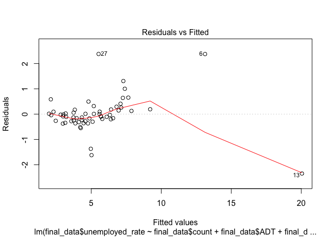<!-- -->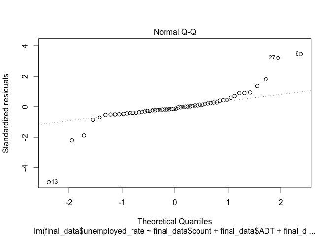<!-- -->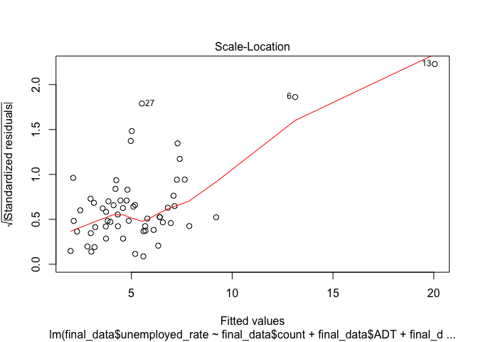<!-- -->

    ## Warning in sqrt(crit * p * (1 - hh)/hh): NaNs produced
    
    ## Warning in sqrt(crit * p * (1 - hh)/hh): NaNs produced

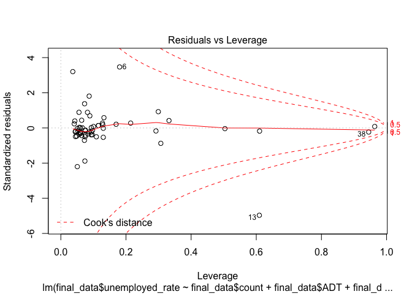<!-- -->

From the R output, we can see that the R^2 is 0.9408, which means that
the features from bridges data (aka the count of bridges, mean of
average daily traffic, mean of bridge roadway width, mean of roadway
improvement cost, mean of total project cost, and mean of average daily
truck traffic) plus the unemployed number and rate from Nov have a
perfect power to predict the unemployment rate in Dec for each county in
CA using a linear model. R^2 for this model increases comparing to the
second model without data from previous month. Looking at the p value
for each beta, we notice that among all the variables, Nov’s
unemployment rate has a p value much less than 0.05, which means that it
is the most statistically significant in this model. Other variables are
not significant at all with the existance of Nov’s unemployment rate in
the model. From the diagnosis plots, I notice that 6, 13 and 27 are
points that may cause problems, refering to Colusa County, Imperial
County, and Monterey County respectively.
